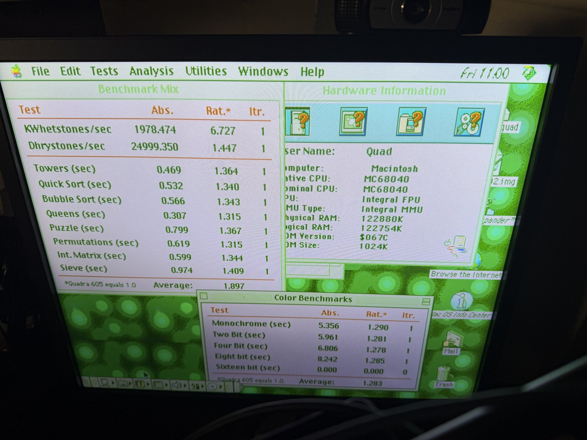
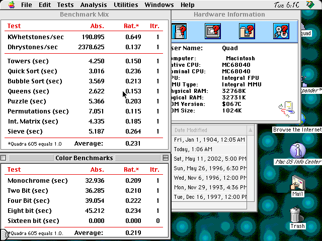
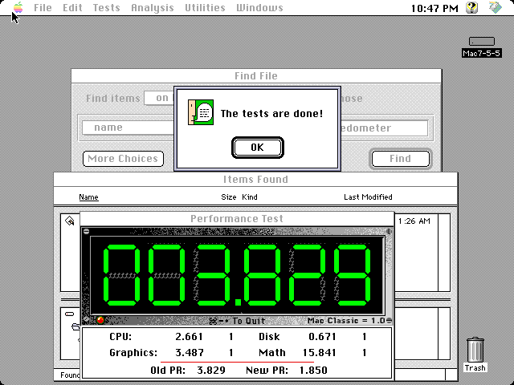
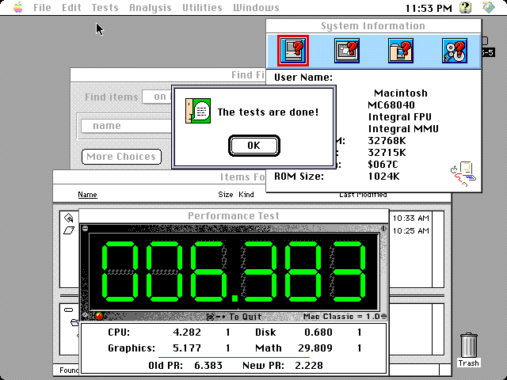
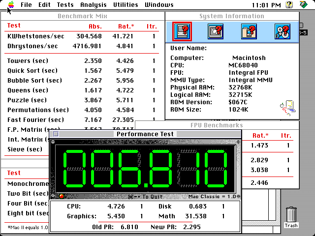
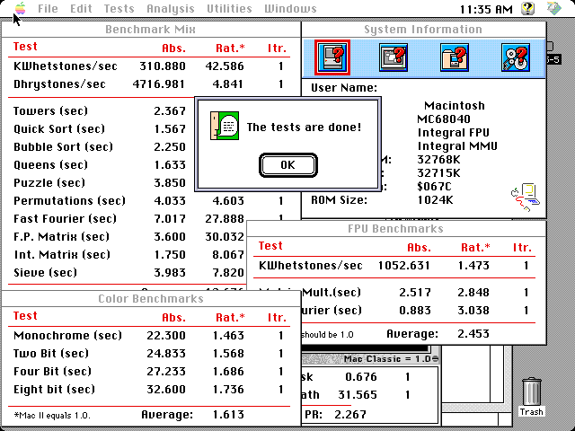

# Performance measurements — Speedometer 4.02

> **2026-09-01 follow-up:** a timing-clean related-clock SDRAM handoff now
> measures 151 ns per isolated read and 22.0 MB/s sequentially in
> `tb_sdram`. On hardware, Speedometer **3.23 PR Tests** improved from CPU
> 2.661 on the seed-13 control to **2.917** on seed 15 (+9.6%). Version 3.23's
> PR score is not the same metric as the 4.02 Benchmark Mix below; see §8.
> A 2026-09-02 BL8/open-page follow-up raises that same 3.23 CPU score to
> **3.139** and passes the full suite; see §9.

Three-way comparison of a **real Quadra 800**, the **Wombat33 core before the
SDRAM fast path**, and the **core with it**. Measured 2026-09-01 on hardware
(DE10-Nano + MiSTer SDRAM board), same disk image, same ROM, same Mac OS.

| | Benchmark Mix | Color QuickDraw |
|---|---|---|
| Real Quadra 800 | **1.897** | **1.283** |
| Wombat33 `20260831_2` (before) | 0.200 | 0.198 |
| Wombat33 seed 13 (after) | **0.231** | **0.219** |
| **Gain from the SDRAM work** | **+15.5 %** | **+10.6 %** |
| **Still short of real hardware by** | **8.2×** | **5.9×** |

Speedometer's ratios are against a **Quadra 605 = 1.0** (FPU against a Quadra
650). Higher is better. For the `(sec)` rows a *lower* absolute is better; for
the `/sec` rows a *higher* absolute is better.

The headline: the memory work is worth a solid, reproducible **15 %** of real
CPU throughput — and the emulated Quadra is still **roughly eight times slower
than the machine it is emulating**.

---

## 1. What was compared

| | Real Quadra 800 | Before | After |
|---|---|---|---|
| Bitstream | — | `releases/wombat33_20260831_2.rbf` | seed 13 of `cpu-speed-sdram` |
| md5 | — | `4414e7b3294b3d554a9e43faa16682bd` | `abb5ede4f776d20ccd74367813aa1d28` |
| Provenance | photograph | commit `cc53fbd` | branch `cpu-speed-sdram`, `3d1f28c` |
| Timing (STA) | — | met, +0.062 ns | **met, +0.132 ns** |
| CPU | MC68040 | MC68040 | MC68040 |
| FPU / MMU | Integral / Integral | Integral / Integral | Integral / Integral |
| ROM | `$067C`, 1024K | `$067C`, 1024K | `$067C`, 1024K |
| Physical RAM | 122880K | 32768K | 32768K |
| Bus clock | 33.33 MHz | 33.000 MHz | 33.000 MHz |

Both Wombat33 md5s were verified **on the MiSTer after the push**, not just
locally. The guest was shut down from the Apple menu before every core swap.

Seed 13 is the fit that **meets timing** — `scripts/deploy_screenshot.sh`
passed it with "Timing OK — worst slack +0.132 ns" and no override, the only
build in this campaign that did. Seed 8 (−0.501 ns) was measured first and
produced numbers identical to seed 13 within noise, which is the expected
result: a fitter seed changes placement, not throughput. See
`wombat33.qsf` for the full seed walk.

Two differences from the real machine worth keeping in mind: it has 128 MB
against our 32 MB (irrelevant to these tests, which are cache- and
bandwidth-bound rather than capacity-bound), and its bus is 1 % faster.

## 2. Benchmark Mix

Absolute values. One iteration of every test, which is what the reference
photograph used.

| Test | Real Q800 | Before | After | After vs before | After vs real |
|---|---|---|---|---|---|
| KWhetstones/sec | 1978.474 | 157.809 | 190.895 | **+21.0 %** | 10.4× slower |
| Dhrystones/sec | 24999.350 | 2033.948 | 2378.625 | **+17.0 %** | 10.5× slower |
| Towers (sec) | 0.469 | 5.048 | 4.250 | **−15.8 %** | 9.1× |
| Quick Sort (sec) | 0.532 | 3.396 | 3.016 | −11.2 % | 5.7× |
| Bubble Sort (sec) | 0.566 | 3.885 | 3.569 | −8.1 % | 6.3× |
| Queens (sec) | 0.307 | 3.047 | 2.622 | −14.0 % | 8.5× |
| Puzzle (sec) | 0.799 | 5.739 | 5.366 | −6.5 % | 6.7× |
| Permutations (sec) | 0.619 | 8.575 | 7.051 | **−17.8 %** | 11.4× |
| Int. Matrix (sec) | 0.599 | 4.766 | 4.335 | −9.0 % | 7.2× |
| Sieve (sec) | 0.974 | 5.821 | 5.187 | −10.9 % | 5.3× |
| **Average ratio** | **1.897** | **0.200** | **0.231** | **+15.5 %** | **8.2×** |

The spread across tests is itself informative. Permutations (+17.8 %) and
Towers (+15.8 %) gain most — both are pointer-chasing, cache-missing workloads
that spend their time waiting on memory. Puzzle (+6.5 %) and Bubble Sort
(+8.1 %) gain least, being tight loops that mostly stay in the '040's caches
and were never waiting on SDRAM. That is exactly the signature the change
should produce, and it is a useful sanity check that the gain is real rather
than measurement drift.

## 3. Color QuickDraw

All four depths from 1-bit to 8-bit; 16 bits/pixel is greyed out in Speedometer
on this hardware and was not run on the real machine either.

| Test | Real Q800 | Before | After | After vs before | After vs real |
|---|---|---|---|---|---|
| Monochrome (sec) | 5.356 | 36.804 | 32.936 | −10.5 % | 6.1× |
| Two Bit (sec) | 5.961 | 40.341 | 36.285 | −10.1 % | 6.1× |
| Four Bit (sec) | 6.806 | 43.115 | 39.054 | −9.4 % | 5.7× |
| Eight bit (sec) | 8.242 | 49.479 | 45.212 | −8.6 % | 5.5× |
| **Average ratio** | **1.283** | **0.198** | **0.219** | **+10.6 %** | **5.9×** |

Colour gains less than the CPU mix (~10 % against ~15 %), which fits: QuickDraw
here is drawing into **VRAM, which is on-chip BRAM**, not SDRAM. Only the
source data and the drawing code itself come through the memory path this
branch touched, so only part of the work could speed up.

## 4. FPU

Not run on the previous release (agreed to skip). Seed 8 only, for the record,
against a Quadra 650 = 1.0:

| Test | Abs. | Rat. |
|---|---|---|
| KWhetstones/sec | 827.979 | 0.159 |
| Matrix Mult. (sec) | 4.572 | 0.154 |
| Fast Fourier (sec) | 1.679 | 0.171 |
| **Average** | | **0.161** |

## 5. How much to trust these numbers

**Benchmark Mix reproduces to under 1 %, across two different bitstreams.**
Four independent runs — three on seed 8 (the last after a flash to the
previous release and back) and one on seed 13:

| Test | s8 run 1 | s8 run 2 | s8 run 3 | seed 13 |
|---|---|---|---|---|
| KWhetstones/sec | 190.959 | 191.395 | 191.015 | 190.895 |
| Dhrystones/sec | 2378.068 | 2379.446 | 2378.287 | 2378.625 |
| Towers | 4.250 | 4.249 | 4.250 | 4.250 |
| Permutations | 7.050 | 7.048 | 7.051 | 7.051 |
| Sieve | 5.186 | 5.169 | 5.187 | 5.187 |
| **Average** | **0.231** | **0.231** | **0.231** | **0.231** |

The previous release was likewise run twice (average 0.200 both times, every
test within 2 %). A 0.200 → 0.231 difference is an order of magnitude larger
than that noise. That seed 8 and seed 13 agree to three decimals is also the
expected control: a fitter seed changes placement and timing closure, not what
the machine computes per second.

**The 8-bit colour test has one bad sample, now identified.** Four
measurements of it on this RTL: 43.713, **32.440**, 45.184 and 45.212 seconds.
Three cluster tightly around 45 s; the 32.440 s reading is a lone outlier. An
earlier sweep that caught it suggested a 22 % colour gain — that number is
wrong, and it is recorded here only so nobody rediscovers it and believes it.
The table in §3 uses the reproducible value. Monochrome, 2-bit and 4-bit
repeat to within 0.5 % across every run. **What produced the single fast
sample is still unexplained and worth a look.**

**A screensaver is armed on this disk** and its idle timeout sits somewhere
between 250 s and 400 s. One early run ended with it up; that run was repeated
inside a shorter window and agreed to three decimals, so it did no harm, but
any future timing work on this machine should keep runs inside ~250 s of the
last input or disable it first.

## 6. Method

Speedometer 4.02, from `Quad Squad:Utilities:`. Driven over the MiSTer remote
websocket (`scripts/mister_ws.py`); helper scripts in `scratch/perf/`.

- The guest's **Command key is PS/2 Left Alt** (`rtl/adb.sv:530` maps it to ADB
  `$37`), i.e. Linux keycode 56, so ⌘B is `down:56 raw:48 up:56`. Speedometer's
  shortcuts — ⌘B Benchmark Mix, ⌘G Color QuickDraw, ⌘F FPU — make the whole
  run keyboard-driven; only the checkboxes need the mouse.
- Navigation to the app used the Finder's **type-select + ⌘O**, which is far
  more reliable than clicking icons.
- **No screenshots were taken during a run.** The capture is an HTTP POST the
  core services, and it perturbs what is being timed.
- Mouse positioning is a closed loop, because mrext sends *relative* motion and
  Mac OS accelerates it — the event-to-pixel scale measured anywhere from 1.3
  to well over 8 px per event depending on how many events got coalesced into
  one ADB report. `scratch/perf/click.sh` pins the pointer into the top-left
  corner (the one position the screen edge makes certain) and then walks to the
  target, re-measuring the scale from a screenshot after every move.
- A dialog screenshotted immediately after it opens can be caught mid-redraw,
  missing its title, static text and button labels. That is not a rendering
  fault; give it a few seconds before grabbing. (It briefly looked like a
  regression from this branch until the same dialog was re-grabbed with a
  settle delay and drew perfectly.)

### Screenshots

Before — `releases/wombat33_20260831_2.rbf`:

After — seed 13 of `cpu-speed-sdram`, the fit that meets timing:

The seed-8 capture (`perf/wombat33_seed8_sdram-fastpath.png`) is kept as the
independent second sample.

## 7. What this says about the SDRAM work

`docs/sdram-fast-path.md` measured the memory path in isolation with
`verilator/tb_sdram.sv`: an isolated store fell from 242 ns to 30 ns and a read
beat from 272 ns to 212 ns. This document is the end-to-end consequence of
that: **+15.5 % on the CPU mix, +10.6 % on colour**, on real silicon running
real Mac OS, in a build that meets timing.

That ratio is worth understanding rather than being disappointed by. An 8×
store latency win does not become an 8× machine win because most instructions
are not stores and most stores were already overlapping with something. The
tests that gained most are the ones that miss cache most, which is the
signature of a genuine memory-path improvement.

**The gap that remains is the interesting part.** At 8.2× slower than a real
Quadra 800 on the CPU mix, the bottleneck is no longer only the platform's
memory path:

- A read beat is now 212 ns of which the SDRAM row cycle is ~81 ns; the rest is
  the two clock-domain crossings. Removing them (§1c of the speed plan) is the
  next platform item and is worth more than its position in the running order
  suggested.
- Page mode (§1d) is the structural prerequisite for real-Quadra bandwidth;
  the follow-up prototype shows it must be paired with a full-line path.
- Beyond that the remaining terms are inside the CPU core — the write-through
  cache with no write buffer, and the lack of an early ack on line fills — which
  live in the `rtl/ap68040` submodule.

A useful next measurement would be the same three-way comparison after the
page-mode work (§1d) lands, to see how much of the 8.2× is memory and how much
is the core.

## 8. Related-clock handoff follow-up (Speedometer 3.23)

The current disposable MacAtrium test disk contains Speedometer 3.23, not the
4.02 copy used above. That prevents a direct update of the real-Q800 comparison,
but it still gives a controlled before/after measurement on one disk and one
benchmark version.

| Speedometer 3.23 PR Test | seed-13 control | seed-15 handoff | gain |
|---|---:|---:|---:|
| CPU | 2.661 | **2.917** | **+9.6%** |
| Graphics | 3.487 | **3.903** | **+11.9%** |
| Disk | 0.671 | **0.679** | +1.2% |
| Math | 15.841 | **18.446** | **+16.4%** |
| Old PR | 3.829 | **4.318** | **+12.8%** |
| New PR | 1.850 | **1.946** | **+5.2%** |

The seed-15 RBF is `releases/wombat33_20260901_2.rbf`, MD5
`d1d785de28439d132333a1c9e3aab5c5`. Quartus reports +0.270 ns overall
setup and +0.241 ns overall hold; the 99 MHz domain is +1.353 ns setup and
+0.431 ns hold. The guest booted Mac OS, completed the PR suite, and was shut
down normally before the disk or core was touched again.

Seed-13 control:

Seed-15 related-clock handoff:

The 4.02 application came from `Quad Squad:Utilities:` on the original 2 GB
Quad Squad image. The currently mounted `QuadSquad8.hda` is a 90 MB disposable
clone of the MacAtrium disk, so recovering that original image from the NAS or
archive is the prerequisite for rerunning the published 4.02 tables.

## 9. BL8/open-page follow-up (Speedometer 3.23)

The next memory-only step keeps the machine's established registered bus
completion but changes the SDRAM side to an open-page controller and captures
the complete BL8 read as a retained 16-byte line. The requested longword is
returned critical-word-first while the burst tail finishes in the background.
The controller tracks open rows independently for all eight `{rank,bank}`
combinations and refreshes both ranks.

A fresh run of the seed-15 handoff RBF immediately before the experiment is
the control below. Both runs used the same pristine `QuadSquad8.hda` image,
Speedometer 3.23, Mac OS 7.5.5, and one iteration of every PR category.

| Speedometer 3.23 PR Test | seed-15 control | BL8/open-page | gain |
|---|---:|---:|---:|
| CPU | 2.917 | **3.139** | **+7.6%** |
| Graphics | 3.817 | **4.159** | **+9.0%** |
| Disk | 0.672 | **0.684** | +1.8% |
| Math | 18.224 | **20.843** | **+14.4%** |
| Old PR | 4.269 | **4.724** | **+10.7%** |
| New PR | 1.928 | **2.013** | **+4.4%** |

The hardware RBF is `Wombat33_BL8_stockmachine_seed17_20260902.rbf`, MD5
`e20f8dfff1d27b4df2195708bcdecc39`. Quartus reports +0.185 ns overall setup
and +0.244 ns overall hold. The full PR suite completed normally, including
Disk. The directed SDRAM model reports 43.7 MB/s for sequential bridge reads,
181 ns for a cold critical word, 121 ns for an open-page read, and 30 ns for a
retained-line read. The whole stock machine transport remains slower at an
estimated 19.5 MB/s / 819 ns per 16-byte fill because each longword still
crosses the registered transaction adapter and service FSM.

Two more aggressive handshakes were rejected on hardware. Both completed CPU
and Graphics but froze during Disk; one included the full pre-adapter line
bypass, while the other disabled that bypass and retained only direct memory
acknowledgement. The passing stock-machine build therefore clears BL8 and the
open-page controller and isolates the remaining fault to the shortened
completion path. Future work should shorten RAM completion only, leaving the
ROM, VRAM, IOSB, DAFB, and open-bus cadence unchanged, and must pass the full
Disk test before it replaces this baseline.

### Registered retained-line service

The first safe follow-up exposes the retained BL8 line to `quadra800`, but
serves its words through the existing registered service-FSM acknowledgement.
It removes three redundant bridge transactions per fill without changing the
transaction adapter's completion cadence. The integrated model improves from
19.5 to **25.1 MB/s**, and a 16-byte fill falls from 819 to **636 ns**.

| Speedometer 3.23 PR Test | BL8/open-page | registered line | gain |
|---|---:|---:|---:|
| CPU | 3.139 | **3.258** | **+3.8%** |
| Graphics | 4.159 | **4.373** | **+5.1%** |
| Disk | 0.684 | 0.679 | -0.7% |
| Math | 20.843 | **21.694** | **+4.1%** |
| Old PR | 4.724 | **4.920** | **+4.1%** |
| New PR | 2.013 | **2.039** | **+1.3%** |

The RBF is `Wombat33_BL8_regline_seed17_20260902.rbf`, MD5
`628021ac778ef96c45d84d9232e4644a`. Quartus reports +0.289 ns setup and
+0.252 ns hold. It booted Mac OS and completed the full PR suite, including
Disk. Against the fresh seed-15 control at the start of this section, the
cumulative CPU gain is **+11.7%** (2.917 to 3.258).

### Registered pre-adapter line hits

The next step bypasses `wombat_bus32` only for aligned longword reads that are
already present in the retained BL8 line. The completion remains a registered
one-cycle pulse. The adapter's active state and previous acknowledgement both
gate the bypass, preventing the just-completed critical word from being
acknowledged twice. A first miss, byte/word or misaligned access, page-table
walk, write, and every non-RAM device continue to use the established adapter
and service-FSM path. A request for the still-arriving tail of the same line
waits instead of launching a duplicate SDRAM transaction.

The integrated post-cache model improves from 25.1 to **43.7 MB/s** and a
16-byte fill falls from 636 to **365 ns**. It passes 64 sequential reads and
2,048 mixed posted-write/read operations in order, while the independent SDRAM
test remains 45/45 with zero chip-protocol errors and the bus adapter remains
6/6. The complete Verilator machine also builds successfully.

| Speedometer 3.23 PR Test | registered line | registered bus line | gain |
|---|---:|---:|---:|
| CPU | 3.258 | **3.378** | **+3.7%** |
| Graphics | 4.373 | **4.536** | **+3.7%** |
| Disk | 0.679 | **0.681** | +0.3% |
| Math | 21.694 | **22.639** | **+4.4%** |
| Old PR | 4.920 | **5.112** | **+3.9%** |
| New PR | 2.039 | **2.072** | **+1.6%** |

The RBF is `Wombat33_BL8_regbusline_seed17_20260902.rbf`, MD5
`df9e97bfc14612b1221cd10112e9dad3`. Quartus reports +0.139 ns setup and
+0.183 ns hold, with zero setup or hold TNS. It booted Mac OS 7.5.5 and
completed one iteration of every PR category, including Disk, before a clean
guest shutdown. The disposable test disk was then restored byte-for-byte from
the pristine image; both copies had MD5 `9c685af4dd7016cf1e664a908e2d9cbe`.

Against the fresh seed-15 control, the cumulative gains are **+15.8% CPU**,
**+18.8% Graphics**, and **+24.2% Math**. The bridge itself has now reached
43.7 MB/s, so the remaining gap to the real Quadra 800's 50--65 MB/s is no
longer dominated by repeated SDRAM reads within a cache fill. The conservative
next memory-only target is first-miss latency: shorten only the RAM critical
word path while retaining a registered CPU-visible acknowledgement and the
adapter's ownership/order checks. Broad direct memory acknowledgement remains
rejected because it froze the hardware Disk test even when line bypass was
disabled.

### Registered direct first miss

Aligned longword reads to decoded RAM now bypass `wombat_bus32` on the first
miss as well as on retained-line hits. The SDRAM completion still enters a
dedicated register before it reaches the CPU, so this does not restore the
combinational direct-ack path that failed the Disk test. Writes, byte/word and
misaligned accesses, page-table walks, and every non-RAM target retain the
established adapter and service-FSM path.

The integrated post-cache model improves from 43.7 to **52.4 MB/s**, inside the
real Quadra 800's 50--65 MB/s sequential-RAM range. A 16-byte fill falls from
365 to **304 ns**. It passes 64 sequential reads and 2,048 mixed
posted-write/read operations in order; the independent SDRAM test remains
45/45 with zero chip-protocol errors, the transaction adapter remains 6/6,
and the complete Verilator machine builds.

| Speedometer 3.23 PR Test | registered bus line | registered first miss | gain |
|---|---:|---:|---:|
| CPU | 3.378 | **3.425** | **+1.4%** |
| Graphics | 4.536 | **4.542** | +0.1% |
| Disk | 0.681 | **0.682** | +0.1% |
| Math | 22.639 | **22.957** | **+1.4%** |
| Old PR | 5.112 | **5.165** | **+1.0%** |
| New PR | 2.072 | **2.082** | +0.5% |

The RBF is `Wombat33_BL8_regfirstmiss_seed17_20260902.rbf`, MD5
`4a92a48e907a3f060e0bdae77905d5ba` and SHA-256
`677c60e85fcd766c59faa026564b511e5433051cb6690078467b11ed68fd30d8`.
Quartus reports +0.143 ns setup and +0.250 ns hold with zero setup or hold
TNS. It booted Mac OS 7.5.5, completed one iteration of every PR category,
including Disk, and shut down cleanly. Against the fresh seed-15 control, the
cumulative gains are **+17.4% CPU**, **+19.0% Graphics**, and **+26.0% Math**.

The MiSTer auto-mount file points at
`games/Wombat33/QuadSquad8.hda`; that is the disposable image. Cleanup after
this run exposed that the previous 9c685... restore command had treated that
mounted file as the source and copied it over the unmounted MacAtrium copy, so
the exact 9c685... snapshot is no longer present. A new cleanly shut-down
golden was established at
`games/MacIIvi/MacAtrium-7.5.5-fullcolor_speedtest.hda`, MD5
`0c4f774b4a2eccd5656e92f16119875f`, with a restore-verified compressed copy at
`games/Wombat33/backup/MacAtrium-7.5.5-fullcolor_speedtest_golden_20260902.hda.gz`.
Future runs must copy or decompress that golden **to** `QuadSquad8.hda`; the
golden must never be used as the restore destination or mounted by the core.

## 10. AP040 retained-line cache fill (Speedometer 3.23)

The first CPU-side optimization reuses the 16-byte line already retained by
`sdram_beat32`. A normal registered RAM read still starts a cache miss. Once the
complete physical line is valid, `ap040_cache` copies its remaining words into
the selected cache way locally, one word per CPU clock, instead of issuing three
more post-cache bus transactions. The tag is validated after all four words are
written, and the CPU receives its acknowledgement only in the existing
`C_TAGW` state. This preserves the completion contract that passed every prior
hardware gate while removing redundant transaction-adapter and service-FSM
handshakes.

An earlier critical-word early-ack implementation was rejected despite passing
the AP68040 suite, SingleStepTests, full-machine simulation, and timing. Two
independent timing-clean all-cacheable builds and a post-overlay physical-RAM-
only build all produced a black screen, while the unchanged memory baseline
booted immediately from the same restored disk. Releasing the CPU before its
cache line is committed is therefore not part of the accepted design.

The accepted seed-17 line-assist build passed the complete AP68040 suite. Its
directed cache test checks that exactly one external read is issued, the other
three words come from the completed-line sideband, the requested word is
correct, and all four later line hits generate no bus traffic. The complete
Wombat Verilator model builds, and the first 100 SingleStepTests corpus rows
match all 1,696 architectural field groups with zero real differences.

| Speedometer 3.23 PR Test | registered first miss | AP040 line assist | gain |
|---|---:|---:|---:|
| CPU | 3.425 | **3.494** | **+2.0%** |
| Graphics | 4.542 | **4.707** | **+3.6%** |
| Disk | 0.682 | 0.679 | -0.4% |
| Math | 22.957 | **23.477** | **+2.3%** |
| Old PR | 5.165 | **5.293** | **+2.5%** |
| New PR | 2.082 | **2.096** | +0.7% |

The RBF is `Wombat33_CPU_lineassist_seed17_20260902.rbf`, MD5
`cee04efa7c3db4e0539e757fafa1d645` and SHA-256
`54cf0f7f6d2c8526d8eab44cfe889f0ff63ce8d629ca40848f155efc2ff715a3`.
Quartus reports +0.348 ns setup and +0.244 ns hold with zero setup or hold TNS.
It booted Mac OS 7.5.5 and completed every PR category, including Disk. Mac OS
was shut down to its safe-to-switch-off screen, the MiSTer returned to its menu,
and the disposable disk was restored from the pristine golden; both images then
matched MD5 `0c4f774b4a2eccd5656e92f16119875f`.

## 11. Two-entry CPU RAM store buffer (Speedometer 3.23)

The next CPU-side optimization hides write-through RAM-store latency behind
later cache hits. A two-entry ordered queue sits below `ap040_cache` and gives a
registered acknowledgement when it captures a non-faulting physical-RAM write.
The queued transactions then drain through the unchanged post-cache platform
bus. Reads, ROM/device writes, and other unqualified transactions wait for all
older stores; MMU table walks are also held, and retained SDRAM lines are hidden
while a store is pending so neither path can observe stale memory. The boot
overlay and all non-RAM address regions retain their previous completion path.

The directed store-buffer test passes direct completion, early store capture,
read-after-write ordering, two-entry FIFO order, full-queue backpressure,
host-disabled bypass, and clock-enable freeze. The complete Wombat Verilator
model builds, and the first 100 SingleStepTests CPU corpus rows match all 1,696
architectural field groups with zero real differences.

Seed 17 was rejected before deployment at -0.323 ns setup and +0.197 ns hold.
TimeQuest placed its only setup failure on the already documented seed-sensitive
SDRAM `open_row` to `command[0]` cross-clock path, not in the CPU or store
buffer. The identical seed-18 netlist meets timing at **+0.165 ns setup** and
**+0.248 ns hold**, with zero setup and hold TNS.

| Speedometer 3.23 PR Test | AP040 line assist | two-entry store buffer | gain |
|---|---:|---:|---:|
| CPU | 3.494 | **3.626** | **+3.8%** |
| Graphics | 4.707 | **4.804** | **+2.1%** |
| Disk | 0.679 | **0.698** | **+2.8%** |
| Math | 23.477 | **26.744** | **+13.9%** |
| Old PR | 5.293 | **5.706** | **+7.8%** |
| New PR | 2.096 | **2.160** | **+3.1%** |

The RBF is `Wombat33_CPU_storebuf_seed18_20260902.rbf`, MD5
`50b318db7b83bba6e418f15ad4e6085a` and SHA-256
`2992d426897f089a7401eca95327507707e9fcf1753986bb8bbe9dc93e4dbe1c`.
It booted Mac OS 7.5.5 and completed one iteration of every PR category. Mac OS
then reached its safe-to-switch-off screen, the MiSTer returned to its menu, and
the disposable disk was restored from the pristine golden. Both images matched
MD5 `0c4f774b4a2eccd5656e92f16119875f` after restoration.

## 12. Preserve data-cache lines on write-through store hits (Speedometer 3.23)

AP040 previously invalidated all four ways in a data-cache set for every
write-through store. An aligned cacheable store now reads the tags and data ways
in parallel with the external write, then merges byte, word, or longword data
into the matching resident way only when the downstream write acknowledges.
The cache remains write-through and has no dirty state. A bus error leaves the
old cached word intact, while cache-inhibited, misaligned, and line-crossing
stores retain the conservative touched-set invalidation path.

The directed cache test fills four tags in one set, updates one resident line,
and requires all four lines to remain hits with no refill traffic. It also
checks big-endian byte and word merges and proves that a faulting store does not
commit speculative lookup data. The complete AP68040 suite and Wombat Verilator
build pass, and the first 100 SingleStepTests CPU rows match all 1,696
architectural field groups with zero real differences.

The first timing attempts exposed an existing 50-level `ir` to `exc_fmt`
instruction-decode cone: seeds 18, 19, and 20 missed setup by 0.610, 1.740, and
2.223 ns respectively. Exception format is now encoded in a registered entry
state and loaded from that shallow decode without changing exception latency or
frame contents. That removed the CPU path. The refactored seed-18 build then
missed only the known placement-sensitive SDRAM `open_row` to `command[0]`
crossing by 1.030 ns; seed 19 meets timing at **+0.378 ns setup** and **+0.251 ns
hold**, with zero setup and hold TNS.

| Speedometer 3.23 PR Test | two-entry store buffer | store-hit update | gain |
|---|---:|---:|---:|
| CPU | 3.626 | **3.878** | **+6.9%** |
| Graphics | 4.804 | **5.130** | **+6.8%** |
| Disk | 0.698 | 0.685 | -1.9% |
| Math | 26.744 | **29.395** | **+9.9%** |
| Old PR | 5.706 | **6.167** | **+8.1%** |
| New PR | 2.160 | **2.190** | **+1.4%** |

The RBF is `Wombat33_CPU_storehit_seed19_20260902.rbf`, MD5
`e6cf83d9a3a49685abd5f2e8235d33cf` and SHA-256
`8a1e268f1a49bf55d5fb507abccc6d6020d0139454f8f0da386405ced26cef23`.
It booted Mac OS 7.5.5 and completed one iteration of every PR category. Mac OS
then reached its safe-to-switch-off screen, the MiSTer returned to its menu, and
the disposable disk was restored from the pristine golden. Both images matched
MD5 `0c4f774b4a2eccd5656e92f16119875f` after restoration.

## 13. AP040 instruction branch-refill buffer (Speedometer 3.23)

The execution prefetch queue is forward-only, so every taken backwards branch
previously discarded its words and repeated the instruction-cache/MMU
handshake. AP040 now retains one 32-byte sector of completed instruction-fetch
data, tagged by logical address and supervisor context. A redirect can seed the
queue when all four contiguous words beginning at its target are valid. Normal
speculative filling resumes after those words drain. Exceptions, CINV, PFLUSH,
MOVEC, and other architectural prefetch flushes invalidate the sector; ordinary
control-flow redirects preserve it.

Packing the sector as eight 32-bit words and requiring a complete four-word
redirect window matters for the target FPGA. Earlier per-word and two-bank
designs did not fit. A 16-bit version fit at exactly 4,191/4,191 LABs but was
placement-fragile. The accepted form uses 39,685/41,910 ALMs and 4,185/4,191
LABs. Placement seed 24 closes timing at **+0.417 ns setup** and **+0.244 ns
hold**, with zero setup or hold warnings.

The complete AP68040 suite and Wombat Verilator build pass. The first 100
SingleStepTests CPU rows match all 1,696 architectural field groups with zero
real differences. The focused `bench_loop` result falls from 326,674 to
289,956 clocks, an **11.24% reduction**.

| Speedometer 3.23 PR Test | store-hit update | branch refill | gain |
|---|---:|---:|---:|
| CPU | 3.878 | **4.282** | **+10.4%** |
| Graphics | 5.130 | **5.177** | +0.9% |
| Disk | 0.685 | 0.680 | -0.7% |
| Math | 29.395 | **29.809** | +1.4% |
| Old PR | 6.167 | **6.383** | **+3.5%** |
| New PR | 2.190 | **2.228** | +1.7% |

The RBF is `Wombat33_CPU_branchrefill_seed24_20260902.rbf`, MD5
`37eb6c6900e508d52d56baa51980ac82` and SHA-256
`38bb27f1633965f71323c3ca490dd17b368c7046ecf24bf1d5e16701721d8b47`.
The exact Quartus build is preserved at
`/home/alans/builds/wombat33_cpu_branchrefill_seed24_20260902`. Mac OS 7.5.5
booted, completed every PR category including Disk, and reached its safe-to-
switch-off screen. The MiSTer then returned to its menu and the disposable disk
was restored from the compressed pristine golden; both disk copies matched MD5
`0c4f774b4a2eccd5656e92f16119875f` afterward.

A combined experiment that retired register-to-register ALU operations early
and collapsed DBcc by one state cut the focused benchmark by a further 15.75%
in simulation, but its timing-clean hardware image froze at Happy Mac. Neither
change was retained. This is evidence against a broad execution-state collapse
as the next step; subsequent pipeline work should be split into small,
independently hardware-tested changes with exception and interrupt boundaries
left intact.

## 14. AP040 memory-source operand retirement (Speedometer 3.23)

Profiling the accepted branch-refill core showed that external read latency was
no longer the dominant cost in the focused loop: 12,784 of 12,801 data reads
completed in two clocks. The remaining memory-source path nevertheless spent a
separate `S_PIPE_SDONE` clock copying the completed read into the operand
registers. For the common memory-source/register-destination case, port B has
already been parked on the destination register by `S_PIPE_SRD`. The read
acknowledgement now captures both operands directly and enters `S_EXEC`, while
page-crossing reads and every other return path retain the original sequence.
This does not add the long register-file-to-ALU combinational path that made the
earlier broad pipeline experiment unsafe.

The complete AP68040 suite and Wombat Verilator build pass. The first 100
SingleStepTests CPU rows match all 1,696 architectural field groups with zero
real differences. That corpus falls from 36,531,511 to 36,241,181 clocks
(-0.79%). The focused `bench_loop` falls from 289,956 to 277,158 clocks, a
**4.41% reduction**, and `S_PIPE_SDONE` disappears from its steady-state
profile as expected.

| Speedometer 3.23 PR Test | branch refill | memory-source retirement | gain |
|---|---:|---:|---:|
| CPU | 4.282 | **4.303** | +0.5% |
| Graphics | 5.177 | **5.218** | +0.8% |
| Disk | 0.680 | **0.685** | +0.7% |
| Math | 29.809 | **29.958** | +0.5% |
| Old PR | 6.383 | **6.419** | +0.6% |
| New PR | 2.228 | **2.244** | +0.7% |

The seed-24 image uses 39,705/41,910 ALMs and 4,187/4,191 LABs. It closes
timing at **+0.536 ns setup** and **+0.246 ns hold**, with zero setup or hold
TNS. The RBF is `Wombat33_CPU_loadretire_seed24_20260902.rbf`, MD5
`4df7fe6317ef39330e02b44c6408d35f` and SHA-256
`c0fc37bbcde912b78964b2d4a21d07b2536b109355d3054e034b324d03ec835c`.
The exact Quartus build is preserved at
`/home/alans/builds/wombat33_cpu_loadretire_seed24_20260902`. Mac OS 7.5.5
booted and completed every PR category, then reached its safe-to-switch-off
screen. The MiSTer returned to its main menu and the disposable disk was
restored from the compressed golden; both disk copies matched MD5
`0c4f774b4a2eccd5656e92f16119875f` afterward.

## 15. AP040 prefetched DBcc retirement (Speedometer 3.23)

DBcc occupied two execution states even though its displacement fetch provides
enough time to select Dn on the combinational register-file port. Decode now
selects that register before entering `S_IMMF`; `S_DBCC1` therefore performs
the decrement, writeback, and branch decision together. Odd-target checking
still happens before the condition, and `go_pc` retains its post-writeback
interrupt barrier. This is deliberately narrower than the rejected broad
register/ALU shortcut: it adds no state-dependent register-file address mux and
does not put the main ALU on the retirement path.

The complete AP68040 suite and Wombat Verilator build pass. The first 100
SingleStepTests CPU rows again match all 1,696 architectural field groups with
zero real differences; the corpus contains little DBcc and changes by only 288
clocks. The focused `bench_loop` falls from 277,158 to 263,496 clocks, a further
**4.93% reduction** and a cumulative **9.13%** reduction from the accepted
branch-refill build's 289,956 clocks.

| Speedometer 3.23 PR Test | memory-source retirement | prefetched DBcc | gain |
|---|---:|---:|---:|
| CPU | 4.303 | **4.413** | **+2.6%** |
| Graphics | 5.218 | 5.224 | +0.1% |
| Disk | 0.685 | 0.684 | -0.1% |
| Math | 29.958 | 29.958 | 0.0% |
| Old PR | 6.419 | **6.465** | +0.7% |
| New PR | 2.244 | **2.254** | +0.4% |

Seed 24 missed CPU setup by 0.188 ns and was rejected without deployment. The
accepted seed-25 image uses 40,566/41,910 ALMs and 4,180/4,191 LABs. It closes
timing at **+0.078 ns worst setup overall** (+0.170 ns on the CPU clock) and
**+0.204 ns hold**, with zero setup or hold TNS. The RBF is
`Wombat33_CPU_loadretire_dbcc_seed25_20260902.rbf`, MD5
`6db5e64aee81ccf280b34e23a8247916` and SHA-256
`a3e84325f3cc1a066afef515eee933c8a74ab51d39f62fb527792b76b89744b5`.
The exact Quartus build is preserved at
`/home/alans/builds/wombat33_cpu_loadretire_dbcc_seed25_20260902`. Mac OS 7.5.5
booted, completed every PR category, and shut down normally. The MiSTer then
returned to its menu and the disposable disk was restored from the compressed
golden; both disk copies matched MD5
`0c4f774b4a2eccd5656e92f16119875f` afterward.

## 16. AP040 simple-An effective-address dispatch (Speedometer 3.23)

Simple `(An)`, `(An)+`, and `-(An)` effective addresses previously spent one
state selecting the address register and a second state consuming it. The
register file has asynchronous read ports, so `ea_start` now selects An while
entering the EA engine. On the following clock, `S_EA_DISP` computes the
address, performs any predecrement or postincrement writeback, and returns
directly to the requesting pipeline state. Displacement and indexed modes keep
their existing multi-state paths, and the memory transaction protocol is
unchanged.

The complete AP68040 suite and Wombat Verilator build pass. The first 100
SingleStepTests CPU rows match all 1,696 architectural field groups with zero
real differences. That corpus falls from 36,240,893 to 35,268,206 clocks, a
**2.68% reduction**. The focused `bench_loop` falls from 263,496 to 250,634
clocks, a further **4.88% reduction** and a cumulative **13.56%** reduction
from the branch-refill build's 289,956 clocks. `S_EA_BASE` disappears from the
profile while the number and latency of data reads remain unchanged.

| Speedometer 3.23 PR Test | prefetched DBcc | simple-An EA dispatch | gain |
|---|---:|---:|---:|
| CPU | 4.413 | **4.613** | **+4.5%** |
| Graphics | 5.224 | **5.287** | +1.2% |
| Disk | 0.684 | **0.685** | +0.1% |
| Math | 29.958 | **30.814** | **+2.9%** |
| Old PR | 6.465 | **6.649** | **+2.8%** |
| New PR | 2.254 | **2.279** | +1.1% |

The accepted seed-25 image uses 39,810/41,910 ALMs and 4,191/4,191 LABs. It
closes timing at **+0.368 ns worst setup overall** and **+0.252 ns worst hold
overall** (+0.433 ns on the CPU clock), with zero setup or hold TNS. The RBF is
`Wombat33_CPU_eafast_seed25_20260903.rbf`, MD5
`48adead0b8be54573cbf0d8810e48465` and SHA-256
`24b66028ea8156ab16b3635309facd36926aef18d49f88f4d0f93499314da1fb`.
The exact Quartus build is preserved at
`/home/alans/builds/wombat33_cpu_eafast_seed25_20260903`. Mac OS 7.5.5 booted,
completed every PR category, and reached its safe-to-switch-off screen. The
MiSTer then returned to its menu and the disposable disk was restored from the
compressed golden; both disk copies matched MD5
`0c4f774b4a2eccd5656e92f16119875f` afterward.

## 17. AP040 decode-preselected source EA (Speedometer 3.23)

The previous simple-An optimization still sent generic source-memory operands
through `S_EA_DISP`, even though decode already knows their address-register
number. Decode now preselects that An on the asynchronous register-file port;
special instructions which need a different port-A register override the
selection in their existing decode branches. When `S_PIPE_START` sees `(An)`,
`(An)+`, or `-(An)` as its source, it computes the address and any register
update directly and proceeds to `S_PIPE_SRD`. Displacement, indexed, absolute,
and PC-relative modes continue through the generic EA engine, and the memory
transaction and retirement paths are unchanged.

The complete AP68040 suite and Wombat Verilator build pass. The first 100
SingleStepTests CPU rows match all 1,696 architectural field groups with zero
real differences. That corpus falls by another 1,387 clocks, from 35,268,206
to 35,266,819. The focused `bench_loop` falls from 250,634 to 237,836 clocks, a
further **5.11% reduction** and a cumulative **17.98% reduction** from the
branch-refill build's 289,956 clocks. `S_EA_DISP` falls from 13,066 visits to
266 while data-read count and latency remain unchanged.

| Speedometer 3.23 PR Test | simple-An EA dispatch | source-EA bypass | gain |
|---|---:|---:|---:|
| CPU | 4.613 | **4.688** | **+1.6%** |
| Graphics | 5.287 | **5.350** | +1.2% |
| Disk | 0.685 | 0.676 | -1.3% |
| Math | 30.814 | **31.049** | +0.8% |
| Old PR | 6.649 | **6.720** | +1.1% |
| New PR | 2.279 | 2.271 | -0.4% |

Seed 25 was rejected without deployment because HDMI setup missed by 0.140 ns,
although the CPU clock had +0.389 ns setup margin. Seed 26 fixed HDMI but was
also rejected without deployment because CPU setup missed by 0.433 ns. The
accepted seed-27 image uses 40,599/41,910 ALMs and 4,186/4,191 LABs. It closes
timing at **+0.502 ns worst setup overall** (+0.631 ns on the CPU clock) and
**+0.243 ns worst hold overall** (+0.431 ns on the CPU clock), with zero setup
or hold TNS.

The RBF is `Wombat33_CPU_sourceea_seed27_20260903.rbf`, MD5
`2ef2aa130fd04fa6da4dc0f938d06c69` and SHA-256
`f36a85b1373384a605e84925a08ec081c66fab2b5da3777768be73629c769c4f`.
The exact Quartus build is preserved at
`/home/alans/builds/wombat33_cpu_sourceea_seed27_20260903`. Mac OS 7.5.5
booted, completed every PR category, and reached its safe-to-switch-off screen.
The MiSTer then returned to its menu and the disposable disk was restored from
the compressed golden; both disk copies matched MD5
`0c4f774b4a2eccd5656e92f16119875f` afterward.

## 18. AP040 memory-source MOVE retirement (Speedometer 3.23)

The common non-page-crossing `MOVE`/`MOVEA` from memory to a register now
retires on the successful data-read acknowledgement. The source-EA path has
already selected the destination register on register-file port B while the
read is in flight, so ordinary `MOVE` can merge byte/word results and update
NZVC directly, while `MOVEA.W` applies its required sign extension. The
existing `fetch_next` boundary still handles trace and interrupts after the
registered writeback. Faulted reads, split page-crossing reads, memory
destinations, and non-MOVE users of the MOVE ALU operation retain the generic
pipeline and `S_EXEC` path.

The complete AP68040 suite and Wombat Verilator build pass. The first 100
SingleStepTests CPU rows match all 1,696 architectural field groups with zero
real differences. That corpus falls from 35,266,819 to 35,204,643 clocks,
saving 62,176 clocks. The focused `bench_loop` falls from 237,836 to 225,036
clocks, a further **5.38% reduction** and a cumulative **22.39% reduction**
from the branch-refill build's 289,956 clocks. All 12,800 eligible loads leave
`S_EXEC`; its occupancy falls from 25,668 to 12,872 while data-read count and
latency remain unchanged.

| Speedometer 3.23 PR Test | source-EA bypass | MOVE read retirement | gain |
|---|---:|---:|---:|
| CPU | 4.688 | **4.739** | **+1.1%** |
| Graphics | 5.350 | **5.438** | **+1.6%** |
| Disk | 0.676 | **0.683** | +1.0% |
| Math | 31.049 | **31.228** | +0.6% |
| Old PR | 6.720 | **6.786** | +1.0% |
| New PR | 2.271 | **2.297** | +1.1% |

The accepted seed-27 image uses 40,755/41,910 ALMs and 4,183/4,191 LABs. It
closes timing at **+0.026 ns worst setup overall** (HDMI), +0.830 ns on the CPU
clock and +0.813 ns on the 99 MHz SDRAM clock. Worst hold is **+0.245 ns
overall**, +0.257 ns on the CPU clock and +0.432 ns on the SDRAM clock, with
zero setup or hold TNS.

The RBF is `Wombat33_CPU_moveretire_seed27_20260903.rbf`, MD5
`0416e38b6f2a6bf05f8d1f51532743f0` and SHA-256
`b840435b33eb76fef411d844979b52c63e077bfde6b4e7d20926346381b2288d`.
The exact Quartus build is preserved at
`/home/alans/builds/wombat33_cpu_moveretire_seed27_20260903`. Mac OS 7.5.5
booted, completed every PR category, and reached its safe-to-switch-off screen.
The MiSTer then returned to its menu and the disposable disk was restored from
the compressed golden; both disk copies matched MD5
`0c4f774b4a2eccd5656e92f16119875f` afterward.

## 19. AP040 register-ADD decode preselection (Speedometer 3.23)

The common `ADD.L Dn,Dn` form previously entered `S_PIPE_START` only to select
the two asynchronous register-file ports before continuing to the combined
operand-capture state. Decode now selects those ports and enters `S_PIPE_REGS`
directly. Operand capture and `S_EXEC` remain unchanged; other sizes, address-
register sources, and every other opcode retain the generic path.

The complete AP68040 suite and Wombat Verilator build pass. The first 100
SingleStepTests CPU rows match all 1,696 architectural field groups with zero
real differences. That corpus falls from 35,204,643 to 35,196,127 clocks,
saving 8,516 clocks. The focused `bench_loop` falls from 225,036 to **212,238**
clocks, a further **5.69% reduction** and a cumulative **26.80% reduction** from
the branch-refill build's 289,956 clocks. `S_PIPE_START` falls from 25,669 to
12,868 visits while `S_PIPE_REGS` and `S_EXEC` are intentionally unchanged.

| Speedometer 3.23 PR Test | MOVE read retirement | ADD decode selection | change |
|---|---:|---:|---:|
| CPU | 4.739 | **4.726** | -0.3% |
| Graphics | 5.438 | **5.445** | +0.1% |
| Disk | 0.683 | **0.680** | -0.4% |
| Math | 31.228 | **31.202** | -0.1% |
| Old PR | 6.786 | **6.780** | -0.1% |
| New PR | 2.297 | **2.288** | -0.4% |

All six hardware scores are within 0.5% of the preceding run. This change is
therefore accepted as a verified focused-workload improvement with a tiny area
reduction, but it is **not claimed as a measurable Speedometer gain**.

The seed-27 image uses 40,738/41,910 ALMs and 4,182/4,191 LABs, 17 ALMs and one
LAB fewer than the preceding checkpoint. It closes timing at **+0.070 ns worst
setup overall**, +0.772 ns on the 33 MHz CPU clock and +0.070 ns on the 99 MHz
SDRAM clock. Worst hold is **+0.245 ns overall**, +0.263 ns on the CPU clock and
+0.430 ns on the SDRAM clock, with zero setup or hold TNS.

The RBF is `Wombat33_CPU_adddecode_seed27_20260903.rbf`, MD5
`cb83d1a71d262a61af9a5508a443506d` and SHA-256
`512558ea68f5bc5e9dfeb79be9bd0860e44f2d2046e4909bb3c6096c6e24816a`.
The exact Quartus build is preserved at
`/home/alans/builds/wombat33_cpu_adddecode_seed27_20260903`. Mac OS 7.5.5
booted, completed every PR category including Disk, and reached its safe-to-
switch-off screen. The MiSTer then returned to its menu and the disposable disk
was restored from the compressed golden; both disk copies matched MD5
`0c4f774b4a2eccd5656e92f16119875f` afterward.

## 20. AP040 FPU register bank in MLABs (area reclaim)

This pass creates headroom for later CPU work; it is not intended to change
instruction timing. The FPU now captures both command-time operands once and
uses the existing destination shadow thereafter. FMOVEM stores share the
ordinary source read port. FP0--FP7 are held in two mirrored 8x80
simple-dual-port MLAB memories, providing two asynchronous reads and one shared
synchronous write. An 8-bit valid mask supplies the architectural reset NaN
without reset muxes on the 640 payload bits.

Quartus infers exactly 1,280 MLAB memory bits in eight Memory LABs. The complete
synthesis netlist falls from 80,721 to 79,252 logic cells, while the FPU falls
from 8,462 logic cells/2,243 registers to 7,091/1,617. The seed-27 physical fit
uses **39,358/41,910 ALMs** and **4,176/4,191 LABs**, respectively 1,380 ALMs
and six LABs below the preceding checkpoint. LAB packing therefore remains the
limiting resource even though the 3.4% ALM reduction is substantial. Timing is
clean at +0.290 ns setup overall (+0.649 ns CPU, +0.591 ns SDRAM) and +0.244 ns
hold overall (+0.262 ns CPU, +0.434 ns SDRAM), with zero TNS.

The complete AP68040 suite, 212,238-cycle focused loop, full-machine Verilator
build, first 100 CPU rows, all 270 FPU rows, all 8 save/restore rows, and all
1,328 CPU/FPU integration rows pass with zero real differences. The hardware
run used Speedometer 3.23 `Run ALL Tests`, not just the PR shortcut, and
completed its additional Color and FPU groups at averages 1.615 and 2.446.

| Speedometer 3.23 PR Test | ADD decode checkpoint | FPU MLAB bank | change |
|---|---:|---:|---:|
| CPU | 4.726 | **4.726** | 0.0% |
| Graphics | 5.445 | **5.452** | +0.1% |
| Disk | 0.680 | **0.685** | +0.7% |
| Math | 31.202 | **31.512** | +1.0% |
| Old PR | 6.780 | **6.814** | +0.5% |
| New PR | 2.288 | **2.301** | +0.6% |

These differences are normal run-to-run variation, so no speed gain is claimed.
The important hardware result is that the asynchronous MLAB reads and shared
write port remain stable throughout the exhaustive CPU/FPU workload. The RBF is
`Wombat33_CPU_fpu_mlab_seed27_20260903.rbf`, MD5
`c4fd9f3140da2658c366156febf8201f` and SHA-256
`4a68ab336a31dda029c1de75bcb6bfeee2b58422d1ef9b5d1fa2745e8a28cd5c`.
The exact Quartus build is preserved at
`/home/alans/builds/wombat33_cpu_fpu_mlab_seed27_20260903`.

Mac OS reached its safe-to-switch-off screen, the MiSTer returned to `MENU`,
and only the disposable `QuadSquad8.hda` was restored from the validated
compressed golden. Both it and the untouched pristine reference then matched
MD5 `0c4f774b4a2eccd5656e92f16119875f`.

## 21. DAFB palette in explicit M10K mirrors (area reclaim)

The DAFB RAMDAC palette needs one CPU read view and one independent scanout
read view. Quartus implemented the original three arrays as three M10Ks plus a
6,144-register second read copy. Parent commit `3a960b5` makes the two views
explicit, writes both, and keeps the video read registered in the `clk_vid`
domain. Quartus instead infers six simple-dual-port M10Ks and preserves the
existing one-pixel palette lookup latency.

The complete synthesis netlist falls from 79,252 to 70,386 logic cells. In the
seed-27 fit, DAFB itself falls from 3,607.5 fitted ALMs/6,782 registers/3 M10Ks
to 406.9 fitted ALMs/610 registers/6 M10Ks. The complete design uses
**36,525/41,910 ALMs**, **4,099/4,191 LABs**, 24,187 registers, and 428 M10Ks.
That is 2,833 ALMs, 77 LABs, and 6,056 registers below the preceding FPU-MLAB
checkpoint at a cost of three M10Ks and 6,144 block-memory bits. Average/peak
routing utilization also falls from 58.9%/85.5% to 48.1%/74.8%.

Timing is clean with zero TNS: +0.447 ns setup overall (+0.587 ns CPU,
+0.552 ns SDRAM), and +0.244 ns hold overall (+0.251 ns CPU, +0.442 ns SDRAM).
The focused independent-clock palette readback/scanout test, full-machine
Verilator build, and first 100 SingleStepTests CPU rows all pass; the latter
matches 1,696 architectural field groups over 35,196,127 cycles with zero real
differences.

The hardware run booted Mac OS 7.5.5 in full color and completed Speedometer
3.23 `Run ALL Tests`, including FPU and Color averages of 2.446 and 1.618.

| Speedometer 3.23 PR Test | FPU MLAB bank | DAFB palette M10Ks | change |
|---|---:|---:|---:|
| CPU | 4.726 | **4.726** | 0.0% |
| Graphics | 5.452 | **5.430** | -0.4% |
| Disk | 0.685 | **0.683** | -0.3% |
| Math | 31.512 | **31.538** | +0.1% |
| Old PR | 6.814 | **6.810** | -0.1% |
| New PR | 2.301 | **2.295** | -0.3% |

These movements are ordinary run variance; the reclaim is not a speed change.
Its value is physical headroom: cumulatively the FPU and palette passes recover
4,213 ALMs and 83 LABs from the register-ADD checkpoint, leaving 92 LABs free.

The exact build is preserved at
`/home/alans/builds/wombat33_dafb_palette_m10k_seed27_20260903`. The RBF is
`Wombat33_DAFB_palette_m10k_seed27_20260903.rbf`, MD5
`c43a310d2c39171e4be7f781904405c4` and SHA-256
`6dbbd34b30d767a32255049cb0e2dad3a9f75dc6454344ac24da9c881d29037c`.
Mac OS reached its safe-to-switch-off screen, the MiSTer returned to its menu,
and the disposable disk was restored from the compressed golden. Both it and
the untouched pristine reference then matched MD5
`0c4f774b4a2eccd5656e92f16119875f`.

## 22. DAFB timing registers in one MLAB (area reclaim)

Parent commit `cec2f3f` combines Swatch's ten horizontal and seven vertical
12-bit timing words in one power-of-two 32x12 MLAB. Their CPU-visible register
addresses remain unchanged. Quartus previously rejected the two small arrays
for memory inference and implemented 204 scattered registers.

The fair comparison is seed 28 on both forms:

| seed-28 metric | palette control | timing MLAB | change |
|---|---:|---:|---:|
| fitted ALMs | 36,659 | **36,592** | **-67** |
| LABs used | 4,096 | **4,080** | **-16** |
| registers | 24,141 | **23,944** | **-197** |
| MLAB bits | 1,280 | 1,664 | +384 |
| routing average/peak | 49.1%/77.1% | **48.4%/76.2%** | lower |

The accepted seed-28 fit leaves 111 of 4,191 LABs free and closes timing with
zero TNS: +0.291 ns setup overall (+0.862 ns CPU, +0.291 ns SDRAM) and +0.243
ns hold overall (+0.254 ns CPU, +0.433 ns SDRAM). Seed 27 fits in 36,463 ALMs
and 4,070 LABs but is rejected because SDRAM setup is -0.453 ns with -0.692 ns
TNS. This is why the committed QSF changes its default seed to 28.

The focused first/boundary/last timing-register and palette test passes. The
full-machine Verilator build passes, and the first 100 SingleStepTests CPU rows
remain exactly 35,196,127 cycles with 1,696 matching architectural field groups
and zero real differences.

Mac OS 7.5.5 booted in full color and completed Speedometer 3.23 `Run ALL
Tests`, including the full Benchmark, PR, Disk, Math, FPU, and Color groups.
Progress screenshots were mistakenly taken while Graphics and Disk were being
timed, contrary to the method in section 6, so the run is accepted as a
functional soak but not as a controlled speed comparison. Its results were CPU
4.726, Graphics 5.204, Disk 0.676, Math 31.565, Old PR 6.743, New PR 2.267,
FPU average 2.453, and Color average 1.613. CPU and the later untouched groups
remain consistent with the prior run; the unperturbed palette checkpoint
remains the performance reference.

The exact build is preserved at
`/home/alans/builds/wombat33_dafb_timing_mlab_seed28_20260903`. The RBF is
`Wombat33_DAFB_timing_mlab_seed28_20260903.rbf`, MD5
`f6db788d637aaf2baf275ef82e015c2a` and SHA-256
`ae937e62a675a248124e2b065db984e29d16ffc916f840d8a0f6abe2c552fd01`.
Mac OS reached its safe-to-switch-off screen, the MiSTer returned to its menu,
and both the restored disposable disk and untouched pristine reference matched
MD5 `0c4f774b4a2eccd5656e92f16119875f`.

## 23. Rejected SUB.L register preselection

The next isolated experiment extended the accepted decode-time register-port
selection from `ADD.L Dn,Dn` to `SUB.L Dn,Dn`. It passed the complete AP68040
suite and full-machine Verilator build. The focused `bench_loop` remained
exactly 212,238 cycles and contained no eligible SUB form. The first 100
SingleStepTests rows fell from 35,196,127 to 35,195,412 cycles, a saving of only
715 cycles (about 0.002%), with all 1,696 architectural field groups matching.

The exact rejected fit is preserved at
`/home/alans/builds/wombat33_cpu_subdecode_seed28_20260904`. At the same seed as
the accepted timing-MLAB checkpoint it used 36,560 ALMs and 4,083 LABs, versus
36,592 ALMs and 4,080 LABs: 32 fewer ALMs but three more LABs. More importantly,
the 99 MHz SDRAM setup path fell from +0.291 ns to -0.296 ns with -0.324 ns TNS.
The CPU setup path remained positive at +1.074 ns and all hold paths passed.
Because the dynamic benefit is negligible and timing no longer closes, the RTL
was reverted without producing or deploying a hardware candidate. Do not
seed-walk this form unless a representative workload later shows substantial
SUB.L register-register traffic.
